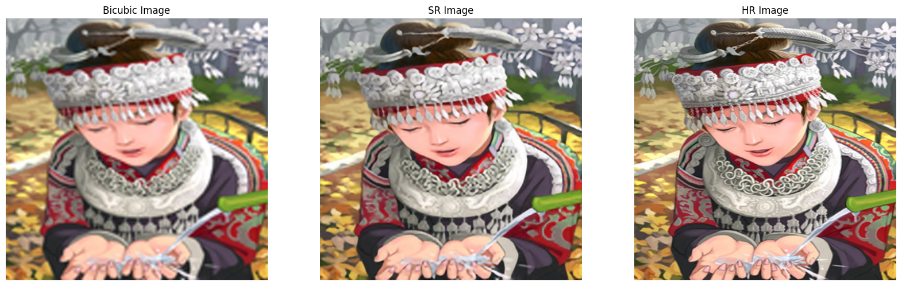

# Single Image Super-Resolution with SRResNet

## Overview
Image Super-Resolution is a machine learning task where the goal is to increase the resolution of an image, often by a factor of 4x or more, while maintaining its content and details as much as possible. The end result is a high-resolution version of the original image. This task can be used for various applications such as improving image quality, enhancing visual detail, and increasing the accuracy of computer vision algorithms.

## Dataset
- DIV2K dataset is used for training and validation.
- Set5 and Set14 are used for testing (inference).
- You can download DIV2K dataset here: https://data.vision.ee.ethz.ch/cvl/DIV2K/

## Methodology
- The Super-Resolution Residual Network (SRResNet) is used, as proposed in the paper "Photo-Realistic Single Image Super-Resolution Using a Generative Adversarial Network" (https://arxiv.org/abs/1609.04802).
- The model was trained for 200 epochs using the L1 loss function.

## Usage
### For training
- Update the image folder path in constants.py if needed.
- Run the following command to start training: `python main.py --mode train --ckpt_dir ./checkpoints`.
### For testing
- Ensure the trained checkpoint (e.g., best_model.pth) exists inside the specified directory.
- Then run the following command to perform inference: `python main.py --mode inference --ckpt_dir ./checkpoints --img_path ./example_image.png`.

## Result
Example output image:

This project was implemented for educational purposes, based on the original SRGAN paper.