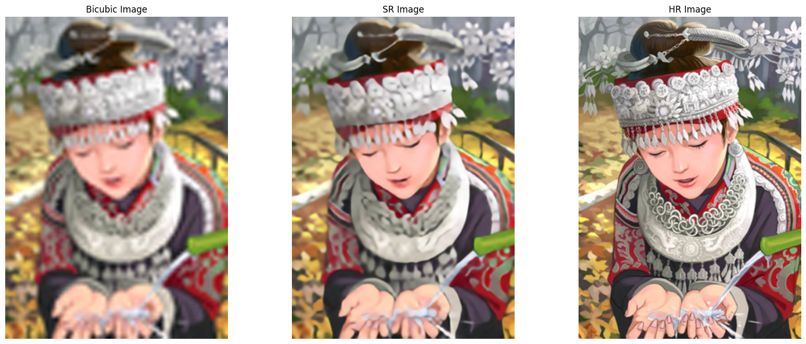

# Single Image Super-Resolution with SRResNet

## Overview
Single Image Super-Resolution (SISR) aims to reconstruct a high-resolution (HR) image from its low-resolution (LR) counterpart, enhancing visual quality and preserving fine details.  
This technique has applications across various domains, including medical imaging, surveillance, and improving the performance of downstream computer vision tasks.

In this project, we implement **SRResNet**, a deep learning model for high-quality image upscaling, based on the paper:  
[*Photo-Realistic Single Image Super-Resolution Using a Generative Adversarial Network*](https://arxiv.org/abs/1609.04802).

---

## Dataset
- **Training and Validation**: **DF2K** dataset, consisting of high-quality (2K resolution) images.
- **Testing**: Standard benchmark datasets **Set5** and **Set14** are used for evaluation.

---

## Methodology
- The **Super-Resolution Residual Network (SRResNet)** architecture is used.
- The model is trained with the **L1 loss function** for **200 epochs**, encouraging sharper image reconstruction and reduced blurring.
- Key components of the model:
  - Deep residual learning with skip connections.
  - PixelShuffle layers for efficient upscaling.
  - Batch Normalization and Parametric ReLU (PReLU) activations.

---

## Usage

### Training
1. Update the image folder path in `constants.py`, if necessary.
2. Run the following command to start training:

```bash
python main.py --mode train --ckpt_dir ./checkpoints
```

### Inference (Testing)
1. Ensure the trained checkpoint (e.g., `best_model.pth`) is saved inside the specified checkpoint directory.
2. Run the following command to perform inference:

```bash
python main.py --mode inference --ckpt_dir ./checkpoints --img_path ./example_image.png
```

## Results
Example output image:



## Notes
This project was implemented for educational purposes, following the original SRGAN paper.

For a more advanced version with adversarial loss and perceptual loss, consider implementing SRGAN.

```
